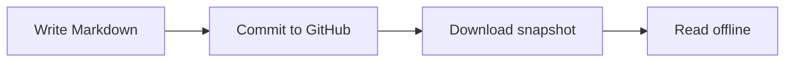
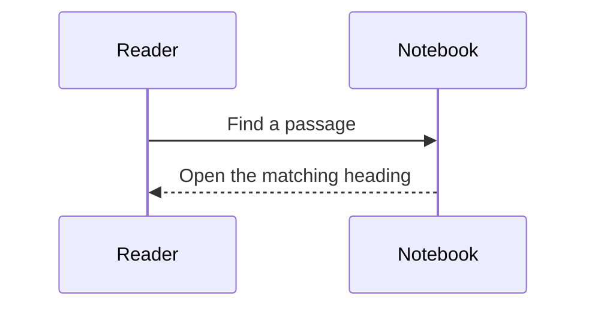
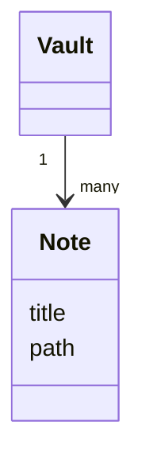
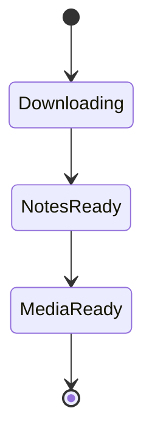
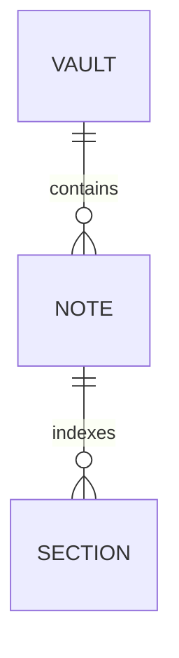
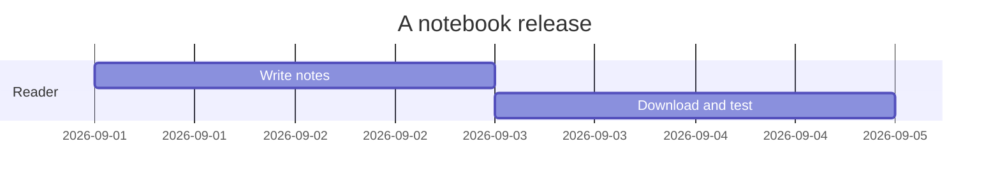

# Diagrams and rich notes

## A simple flow



## A conversation



## Math

Inline math: $E = mc^2$.

$$\sum_{k=1}^{n} k = \frac{n(n+1)}{2}$$

## Code

```swift
let message = "Your knowledge, within reach."
print(message)
```

## Table

| Feature | Offline |
| --- | --- |
| Downloaded notes | Yes |
| Search | Yes |
| Cached media | Yes |
| Remote images | No automatic requests |

- [x] Read the sample
- [ ] Create your own notebook

[[Welcome#^compass|Return to the compass passage]]

## Class diagram



## Snapshot states



## Relationships



## A small timeline


