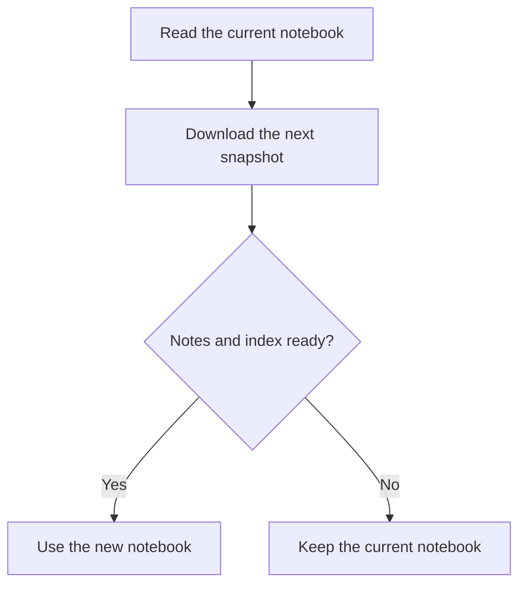

# Keep a useful offline copy

A fictional decision record for a small field-reference app.

## The question

People reach for their reference notes on trains, between meetings, and in buildings with unreliable reception. What should happen if the connection disappears halfway through an update?

## The decision

Keep the last complete snapshot available while a new one downloads. Switch the reader to the new copy only when its note text and search index are ready together.

## Why a stale note can still be useful

A slightly stale reference is often more useful than an empty screen. Show when the notebook was refreshed so the reader can decide whether its age matters. Never silently present an incomplete download as a complete notebook. ^stale

This choice fits stable reference material. It does not make an offline copy suitable for live operational status.

## What about attachments?

Text and media have different download costs. Make their status separate: the notes may be ready before a large PDF finishes. Tell the reader which attachments are missing before they go offline.

| Situation | Reader behavior |
| --- | --- |
| Complete previous copy, interrupted update | Keep the previous copy available |
| Text ready, PDF pending | Allow reading; label the missing media |
| External link | Open only when the reader chooses it |

## What we should check

Use [[Playbooks/Before a release#Take it offline|the offline checklist]] before shipping a change to this flow. For a quick look at what changed locally, keep [[Reference/Git commands worth keeping]] nearby.

[Back to the sample notebook](../README.md)
